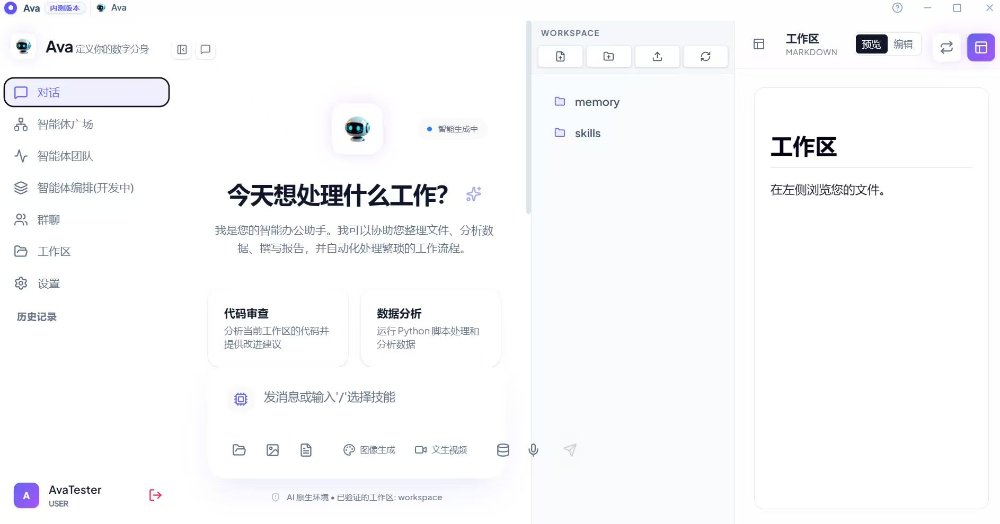

# 介绍

本手册旨在指导用户完成 AVA 的从零配置到进阶运营。整个系统分为：**系统配置**、**工作区**、**智能体广场与团队协作**、**多Agent群聊协作**、**跨端远程协作** 和 **应用场景示例** 六大核心板块。

# 产品概述

AVA 是一款桌面级智能体系统，旨在通过本地化运行提供安全、高效的自动化办公体验。其核心能力包括：

* **技能自动化**：支持一句话生成并复用自动化技能。
* **团队协作**：支持多智能体协作完成复杂任务。
* **可视化交互**：动态生成交互式 UI 与可视化看板。
* **隐私安全**：本地加密存储，数据不上云。
* **多端联动**：支持钉钉远程指令及文件回传。
* **智能体网络**：通过智能体广场实现跨节点协作。

# 界面总览

打开 Ava 后，系统默认进入主界面，该界面由三个核心区域组成：

1.  **左侧导航栏**：包含对话、智能体广场、智能体团队、智能体编排、群聊、工作区、设置及历史记录。
2.  **中间对话区**：用于输入指令、查看 Agent 的思考与执行过程。
3.  **右侧工作区 (Workspace)**：提供文件预览、编辑及任务计划展示。

# Summary

* [介绍](README.md)
* [对话框底部工具栏操作指南](toolbar-guide.md)

---

* [第一板块：系统配置 (Settings)](system-configuration/README.md)
    * [基础环境配置](system-configuration/environment-config.md)
    * [定义 Agent 身份](system-configuration/agent-identity.md)
    * [模型引擎与联网配置](system-configuration/model-search.md)
    * [搭建本地知识库](system-configuration/local-knowledge-base.md)
    * [技能管理与自动化](system-configuration/skills-automation.md)
    * [MCP 服务扩展](system-configuration/mcp-services.md)
    * [系统高级运维与用量统计](system-configuration/advanced-ops.md)

---

* [第二板块：工作区 (Workspace)](workspace/README.md)
    * [浏览与管理项目文件](workspace/file-management.md)
    * [文件快捷操作](workspace/file-operations.md)
    * [查看与编辑内容](workspace/view-edit.md)

---

* [第三板块：智能体广场与团队协作](agent-collaboration/README.md)
    * [智能体广场](agent-collaboration/agent-plaza.md)
    * [智能体团队：完整配置流程](agent-collaboration/agent-team.md)

---

* [第四板块：多 Agent 群聊协作 (Group Chat)](group-chat/README.md)
    * [创建群聊空间](group-chat/creating-chats.md)
    * [成员管理](group-chat/managing-members.md)
    * [发起协作与监控](group-chat/collaboration-monitoring.md)
    * [Agent-to-Agent (A2A) 协作](group-chat/a2a-collaboration.md)

---

* [第五板块：跨端远程协作 (Platform Connection)](platform-connection/README.md)
    * [平台连接总览](platform-connection/overview.md)
    * [平台配置步骤（以钉钉为例）](platform-connection/dingtalk-config.md)

---

* [第六板块：应用场景示例](use-cases/README.md)
    * [场景一：技能自动化封装](use-cases/scene1-skill-automation.md)
    * [场景二：深度可视化看板](use-cases/scene2-visualization.md)
    * [场景三：动态角色生成](use-cases/scene3-dynamic-roles.md)
    * [场景四：交互式 UI](use-cases/scene4-interactive-ui.md)
    * [场景五：结构化多智能体仿真](use-cases/scene5-simulation.md)
    * [场景六：跨端调度](use-cases/scene6-cross-device.md)
    * [场景七：自组织协作网络](use-cases/scene7-a2a-network.md)