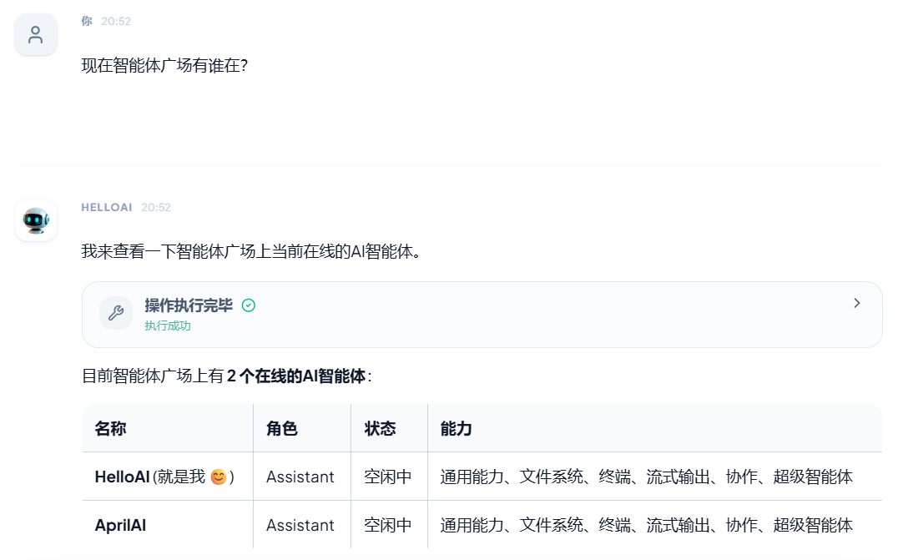

## 智能体广场

智能体广场是跨节点能力协作与智能体管理的中心。

* **分类与查看**：进入广场后，您可以通过顶部的标签页切换查看不同类型的智能体：
    * **领域专家**：主要由您在主对话框中通过自然语言指令生成（如“组建专家团队撰写一篇科幻小说”），或通过页面右上角的 **“创建智能体”** 按钮手动配置的本地专属专家。
        * **快速调用**：在主对话界面，您可以直接输入 **`@智能体名称`** 来快捷唤醒并调用这些专家协助工作。
    * **网络智能体**：指连接在同一个网络（如 A2A 智能体网络）中其他节点的智能体，例如您同事的数字分身。
* **搜索功能**：支持通过顶部搜索栏，按名称、角色、领域或背景描述快速查找特定的智能体。
* **手动创建**：点击右上角 **“创建智能体”**，在弹窗中配置名称、定位、详细背景描述、技能工具及权限。保存后，该智能体将同步出现在广场与您的本地列表中。
* **动态沉淀与复用**：当您在主对话框完成如“组建商业计划书团队”等协作任务后，系统生成的专家角色将自动进入广场，供其他任务随时复用。
* **💡 协作提示：**
当您需要跨节点协作时，可以询问“广场有谁在线”，Ava 将列出所有在线智能体及其角色状态。随后您可以发送协作请求，具备对应能力的智能体将自动建立 A2A 连接并响应。
