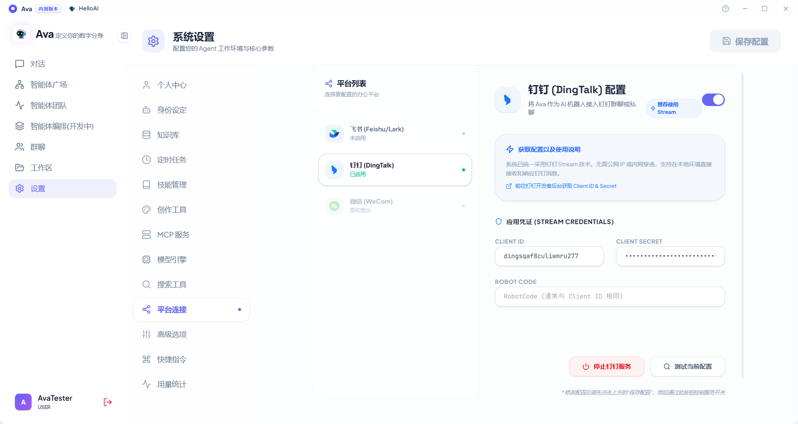

### 2. 平台配置步骤（以钉钉为例）
1.  **获取凭证**：前往钉钉开发者后台，获取对应机器人的 `Client ID` 和 `Client Secret`。
2.  **填写应用凭证 (STREAM CREDENTIALS)**：在配置界面输入 `Client ID`、`Client Secret` 以及 `Robot Code`。
3.  **保存并激活**：
    * 修改完成后，必须先点击右上角的 **“保存配置”**。
    * 点击底部的 **“测试当前配置”** 验证连通性。
    * 通过 **“启动服务”** 按钮控制服务的开启与停止。

