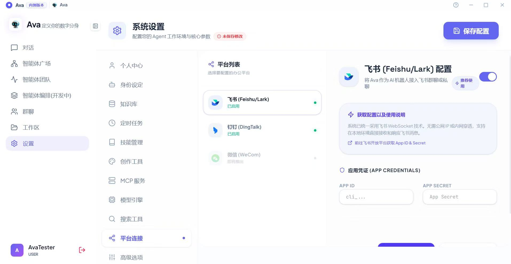

### 1. 平台连接总览
进入 `设置` -> `平台连接`，可选择您需要配置的办公平台。
* **支持平台**：当前已支持 **钉钉 (DingTalk)** 和 **飞书 (Feishu/Lark)**，微信 (WeCom) 正在接入中。
* **核心优势 (Stream 技术)**：系统推荐采用 **Stream 技术**。该模式无需复杂的公网 IP 或内网穿透配置，直接支持在本地环境安全地接收和响应办公群聊/私聊消息。
