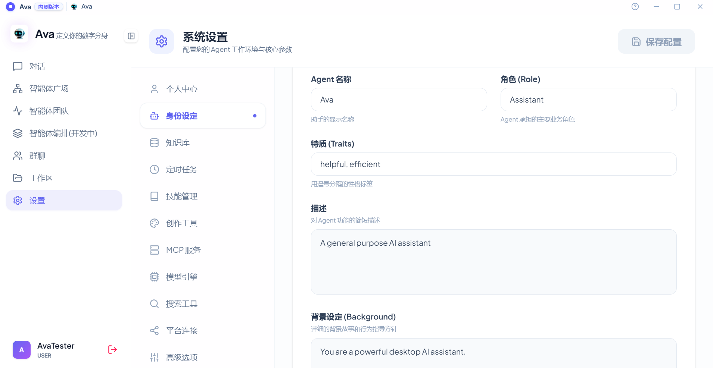

### 2. 定义 Agent 身份 (Roleplay)
* **个性化设定：** 进入 `身份设定`。
    1.  **名称/角色：** 输入 Agent 名称（如：ResearchBot）和职业定位。
    2.  **特质标签：** 使用逗号分隔关键词（如：`professional, rational, efficient`）。
    3.  **背景设定 (System Prompt)：** 在此框中输入详细的操作指令、对话风格和限制条件。
* **保存：** 修改后务必点击右上角的 **"保存配置"**。

