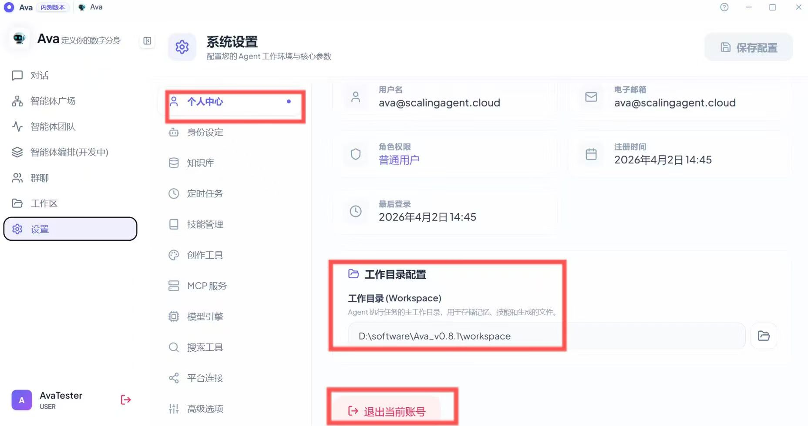

### 1. 基础环境配置 (Workspace Path)
* **设置工作路径：** 进入 `个人中心` -> `工作目录配置`。点击文件夹图标，选择一个本地路径作为 Agent 的文件 Workspace。
    > **⚠️ 注意：** 所有的长期记忆、学习技能、项目文件和 Artifact 均会存储于此路径下。建议选择磁盘空间充足的分区。
* **账号管理：** 在此页面查看账号权限及到期时间。如需切换账号，点击底部的 `退出当前账号`。

