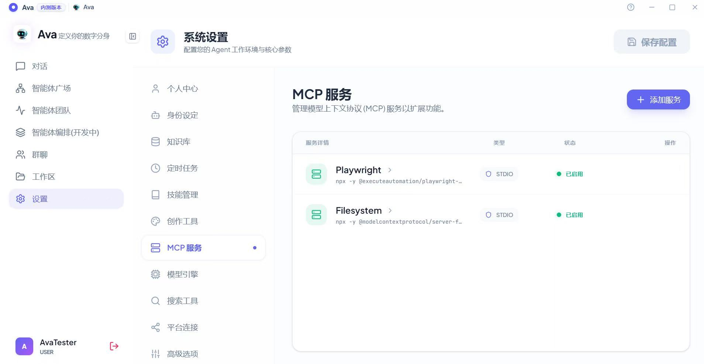

### 6. MCP 服务扩展 (MCP Services)
**MCP (Model Context Protocol)** 是赋予 Agent 外部工具能力（如操作浏览器、访问文件系统）的标准协议。

* **服务列表：** 进入 `MCP 服务`。您可以查看当前已启用的服务（如 `Playwright` 浏览器自动化、`Filesystem` 本地文件操作）及其运行状态。

* **添加 MCP 服务：** 点击右上角 **“+ 添加服务”**。
    1.  **手动表单：** 输入服务名称、选择传输方式（通常为 `stdio`）、输入启动命令（如 `npx`）及参数（ARGS）。
    2.  **粘贴 JSON：** 也可以直接点击切换到“粘贴 JSON”模式，一键导入复杂的 MCP 配置代码。
