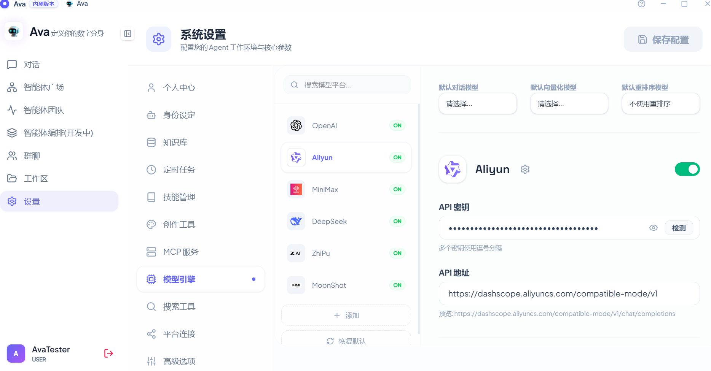

### 3. 模型引擎与联网配置 (Model & Search)
* **接入云端模型：** 进入 `模型引擎`。
    * 在左侧列表选择供应商（如 OpenAI、DeepSeek、阿里云）。
    * 输入您的 `API 密钥`。点击右上角下拉菜单设置默认对话模型。
* **开启联网搜索：** 进入 `搜索工具`。填入对应的 API Key（如 **Tavily** 或 Bing）。Agent 将根据配置自动调用网络搜索来增强回答。
