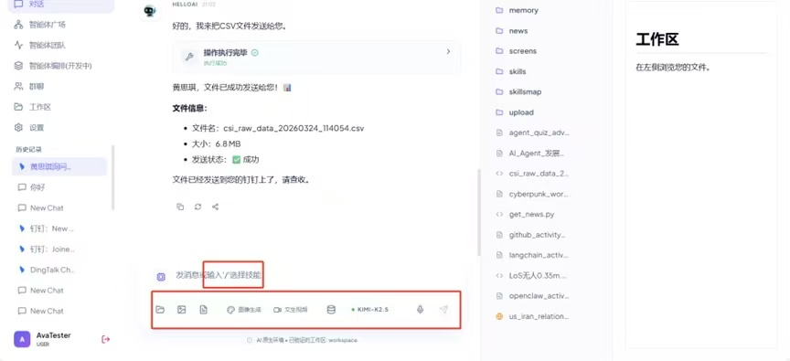

# 对话框底部工具栏操作指南

对话框下方的工具栏集成了多模态处理与文件管理功能：

| 功能图标 | 核心用途与操作方法 |
| :--- | :--- |
| **文件夹** | **本地文件浏览**：点击可展开本地工作目录。选择文件即可将其直接发送给 AVA 处理。 |
| **图片** | **上传与识图**：选择本地图片上传，配合指令（如"分析图片"、"提取文字"）进行多模态理解交互。 |
| **文件** | **数据处理**：上传文件后，可直接指令 AVA "分析这份 excel 文档"或"帮我运行这个脚本"。 |
| **图像生成** | **AI 绘图**：点击并输入画面描述词，选择尺寸风格等信息，生成结果将直接保存至工作区。 |
| **文生视频** | **视频创作**：输入场景与时长描述等信息，生成短视频预览。 |
| **知识库** | **本地 RAG**：上传私有文档。开启后，AVA 将优先引用知识库内容回答。 |
| **模型选择** | **快速切换**：点击下拉框选择可用模型，系统将根据任务性质即时生效。 |
