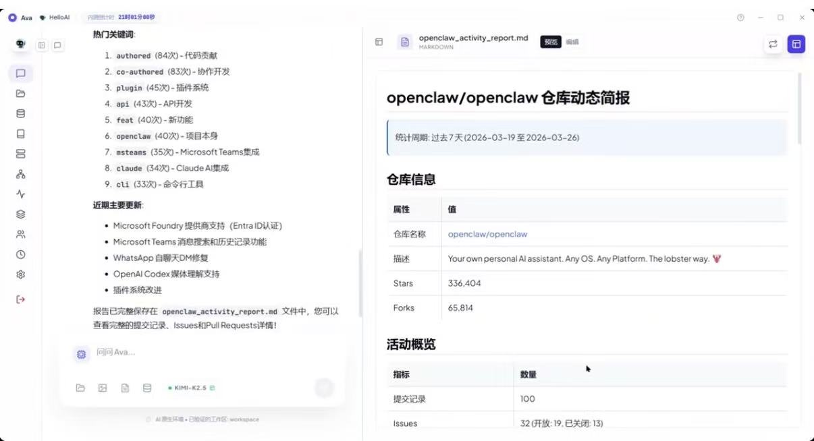

### 场景一：技能自动化封装：一句话追踪 GitHub 开源动态
**目标**：将 GitHub 项目追踪等重复性劳动封装为自动化技能。
* **第一步**：在对话框输入指令："在工作区编写 Python 脚本调用 GitHub API，提取过去 7 天动态关键词，并封装成带重试机制的技能"。
* **第二步** AVA 自动生成脚本并保存到 Workspace，完成技能封装。
* **执行任务**：后续只需指明使用该技能，即可快速助您生成您喜欢的社区简报。
