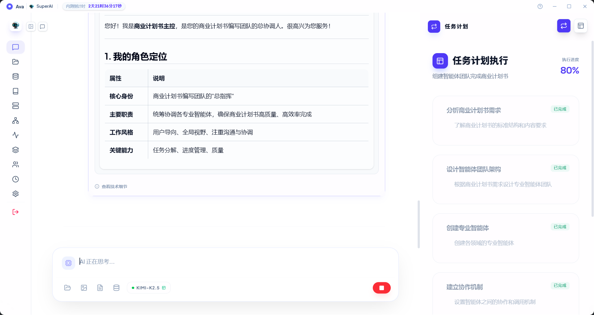

### 场景三：动态角色生成：商业计划书 (BP) 专家团队协作
**目标**：随需组建专业团队完成复杂任务（如：商业计划书 BP）。
* **操作**：对 Ava 说："帮我组建一个团队来完成商业计划书"。
* **分配**：Ava 自动创建 6 人专家组，包含主控统筹、项目管理、文案撰写及战略规划专家。
* **输出**：团队分工执行，进度实时可见，最终在 Workspace 生成包含市场分析与财务模型的专业计划书。
