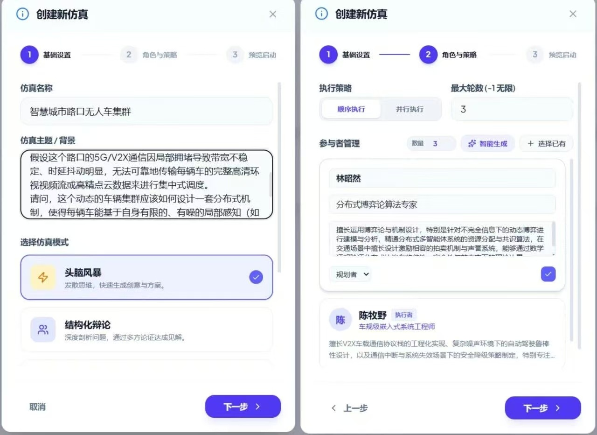

### 场景五：结构化多智能体仿真：自动驾驶路权协商模拟
**目标**：通过多智能体仿真解决高维度问题（如：自动驾驶路权协商）。
* **步骤 1**：点击"智能体团队" -> "新建仿真"，选择多智能体协作模式。
* **步骤 2**：组建 AI 智囊团，并根据场景编辑各个 Agent 的提示词。
* **步骤 3**：在透明的 Workspace 内启动仿真，记录智能体间的决策交互与语义共识。
