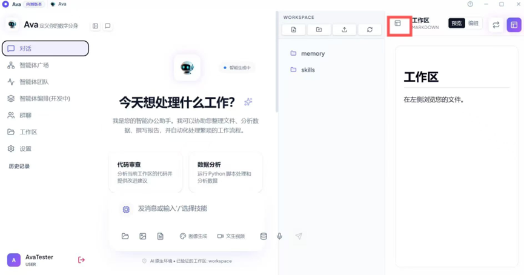

### 1. 浏览与管理项目文件 (Resource Manager)
* **进入工作区**：点击左侧导航栏的 **"工作区"** 图标进入。
* **资源管理器**：中间区域为资源管理器，展示了当前项目的所有文件夹（如 `memory`、`skills`、`upload` 等）和具体文件（如 `.md`、`.py`、`.csv` 文件）。
* **搜索文件**：您可以在资源管理器顶部的搜索框中输入文件名，快速定位所需资源。
